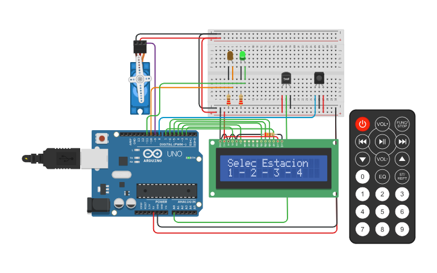

# Deteccion de incendios 

## Integrantes 
- Grimaldi Emiliano

## Proyecto: Sistema de incendios.

## Descripción
El objetivo de este proyecto es diseñar un sistema de incendio utilizando Arduino que pueda
detectar cambios de temperatura y activar un servo motor en caso de detectar un incendio.
Además, se mostrará la temperatura actual y la estación del año en un display LCD.

## Funciónes principales
Esta funcion se encarga de retornar la estancion del año segun el valor recibido por parametro.

El valor recibido por parametro es la tecla presionada del control remoto

~~~ C++ (lenguaje en el que esta escrito)
String obtenerEstacionNombre(int teclaValor) 
{
  switch(teclaValor) 
  {
    case 1:
      return "Verano";
    case 2:
      return "Primavera";
    case 3:
      return "Otonio";
    case 4:
      return "Invierno";
  }
}
~~~

Esta funcion se encarga de detectar el incendio en cada estacion segun su temperatura maxima
Recibe la estacion y la temperatura detectada por el sensor de temperatura
~~~ C++ (lenguaje en el que esta escrito)
bool detectarIncendio(String estacion, int temperatura)
{
	
  if(estacion == "Verano" && temperatura >= 45)
  {
	return true;
  }
  else
  {
	if(estacion == "Primavera" && temperatura >= 35)
    {
		return true;
    }
    else
    {
		if(estacion == "Otonio" && temperatura >= 25)
        {
			return true;
        }
      	else
      	{
			if(estacion == "Invierno" && temperatura >= 15)
            {
				return true;
            }	
      	}
    }
  }
  return false;
}
~~~

## Link del proyecto 
- [Proyecto](https://www.tinkercad.com/things/75A1FZXPWzx)

---
### Fuentes
- [Consejos para documentar](https://www.sohamkamani.com/how-to-write-good-documentation/#architecture-documentation).

- [Lenguaje Markdown](https://markdown.es/sintaxis-markdown/#linkauto).

- [Markdown Cheatsheet](https://github.com/adam-p/markdown-here/wiki/Markdown-Cheatsheet).

- [Tutorial](https://www.youtube.com/watch?v=oxaH9CFpeEE).

- [Emojis](https://gist.github.com/rxaviers/7360908).

---

